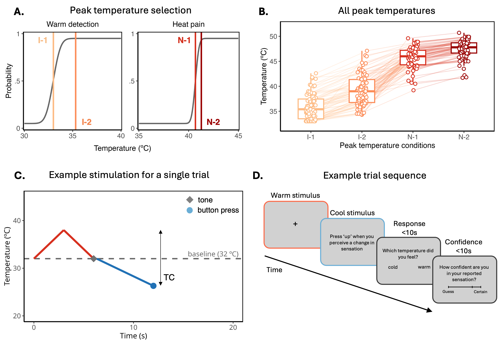
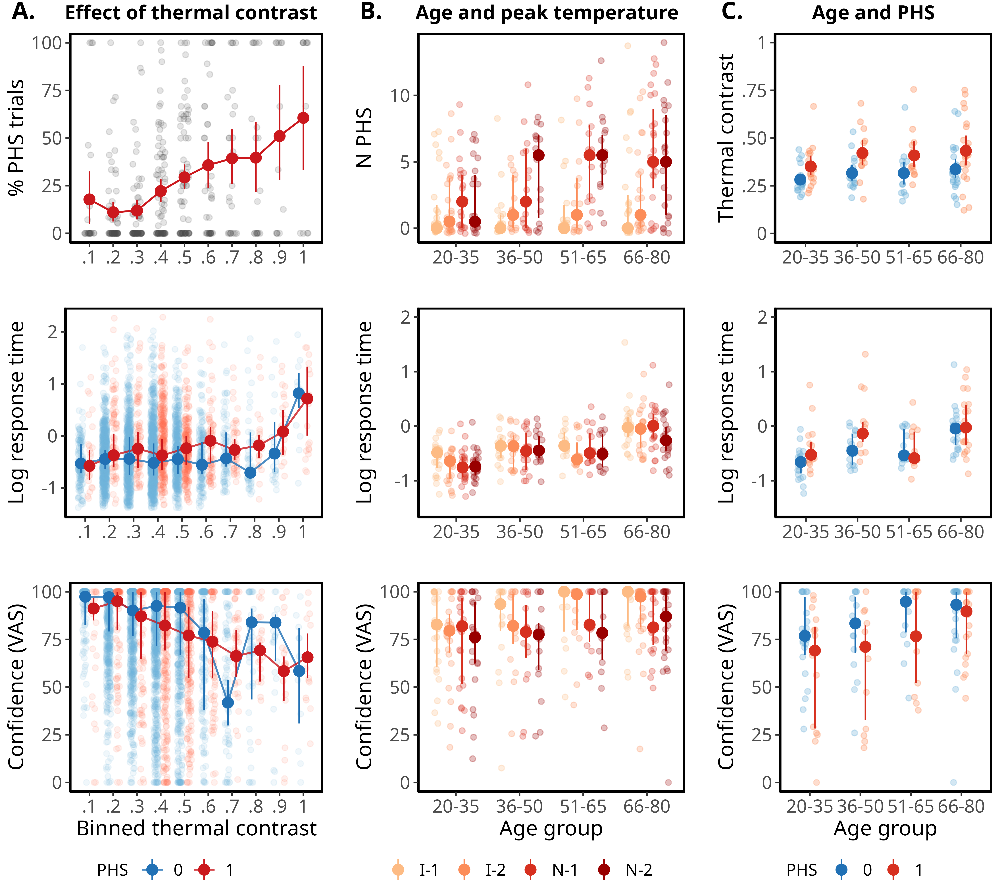
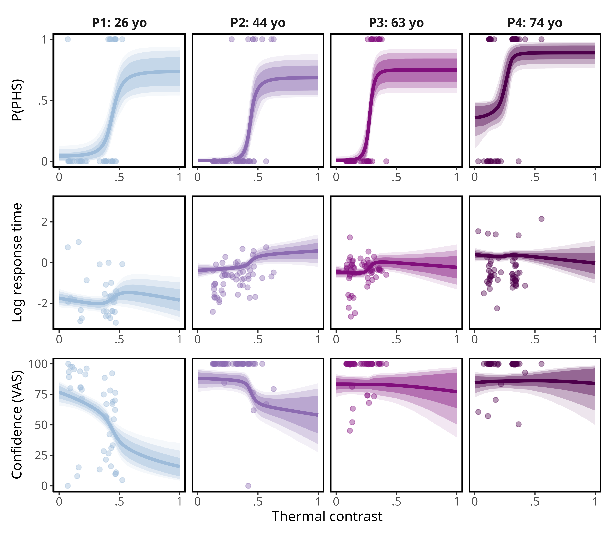
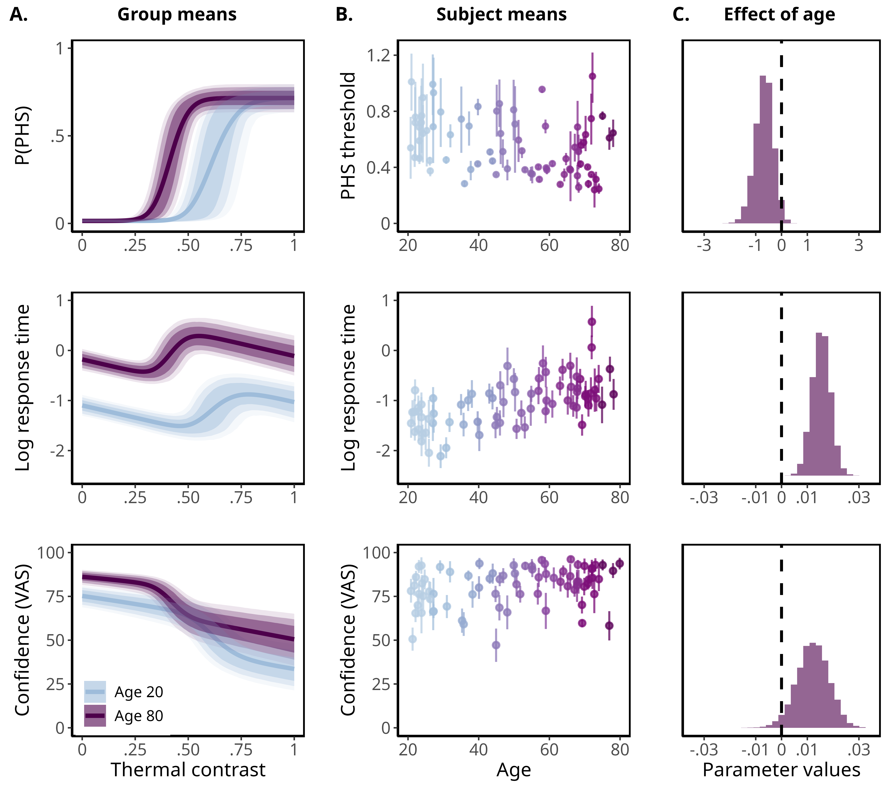

# Thermal contrast enhancement and paradoxical heat sensation across the lifespan


Here you find the analysis, experiment, data and models for the [preregistered](https://osf.io/t5nmd) Thermal contrast enhancement and paradoxical heat sensation across the lifespan study.

## **Repository Structure**  

The repository is structured in the following way:

```         
phs-ageing/
│
├── data/                 # Trial level data from the experiment
│   └── ... 
│
├── manuscript/          # Folder containing everything needed to recreate the final manuscript in pdf,docx and html.
│   ├── Manuscript.Rmd                # Rmarkdown for the final manuscript.
│   ├── Introduction.Rmd              # Rmarkdown for the Introduction
│   ├── Results.Rmd                   # Rmarkdown for the Results.
│   ├── Methods.Rmd                   # Rmarkdown for the Methods
│   ├── Supplementary material.Rmd    # Rmarkdown for the Supplementary material.
│   ├── objects                       # R-objects generated for reporting the main manuscript.
│   ├── figures                       # Figure for the main manuscript.
│   └── Kntting files/                # Files used for knitting the manuscript.
│
├── analysis/            # Folder containing markdowns for extracting the main information
│   ├── extract_results/              # Directory for extracting the main results reported
│   ├── functions/                    # Functions for convinience
│   └──  stanmodels/                   # The two main hierarchical models, aswell as two single subject models
│
├── figure_code/            # Folder containing R objects for fitted models.
│   ├── figure2.Rmd                   # Rmarkdown for making plot2
│   ├── figure3.Rmd                   # Rmarkdown for making plot3
│   ├── figure4.Rmd                   # Rmarkdown for making plot4
│   ├── figure5.Rmd                   # Rmarkdown for making plot5
│   ├── figure6.Rmd                   # Rmarkdown for making plot6
│   └── Platenotation/                # Tex file for making the platenotation
│
│
│ 
├── stimuli/               # Folder containing MATLAB scripts for running the experiment.
│   ├── helpers                      # Folder containing all helper functions for the experiment.
│   │    └── ... 
│   │ 
│   ├── phs_contrast_launcher.m      #
│   │ 
│   ├── PHS_contrast_main.m          # 
│   │ 
│   ├── phs_contrast_tutorial.m      # 
│   │ 
│   └── task_loadParams.m            # 
│
└── README.md             # overview of the project.


```


# Main plots:









